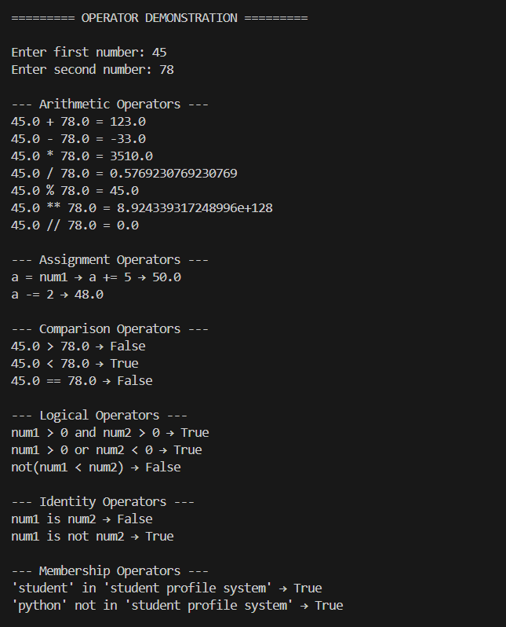
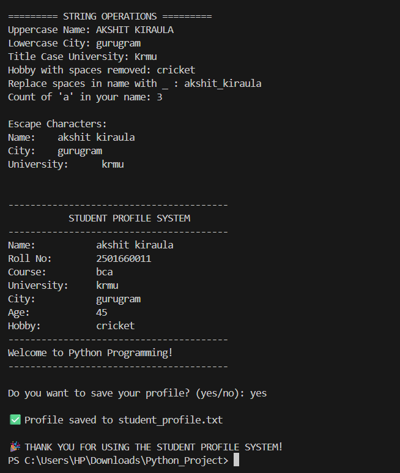

# ---------------------------------------------------------------
- Name: Akshit kirula
- Roll No: 2501660011
- Course: BCA
- Semester: 1st
- Subject: Problem Solving with Python
- Assignment: Unit-1 Mini Project
- Title: Student Profile Console App
- Date: 14-11-25
# ---------------------------------------------------------------

# OUTPUT

1. Input Details

   

2. Operations 

   

3. Student Profile

   

4. students_profile.txt

   

# Student Profile Console App

A simple Python-based console application created as a Unit-1 Mini Project for the course **Problem Solving with Python**. The program collects student information, demonstrates Python operators, performs string operations, and generates a formatted student profile. It also includes an optional feature to save the profile to a `.txt` file.

## Features
- Welcomes the user with a console banner
- Collects student details using input()
- Demonstrates:
  - Arithmetic operators
  - Assignment operators
  - Comparison operators
  - Logical operators
  - Identity & Membership operators
- Performs string formatting operations
- Displays a final student profile card
- Option to save the profile to a text file

## File Output
If the user chooses to save the profile, the app creates a file named **student_profile.txt** containing the complete student details.

## How to Run
1. Install Python on your system
2. Save the script as `student_profile.py`
3. Run the program

