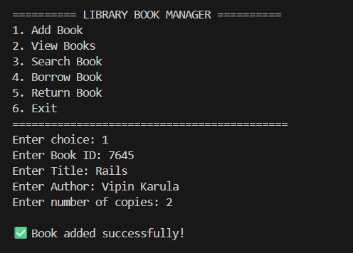
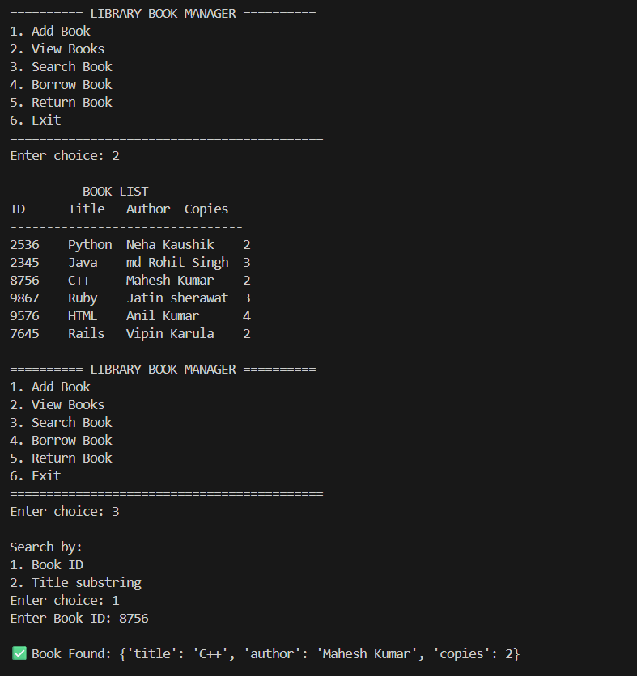
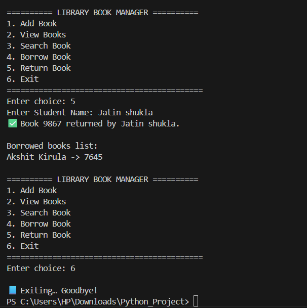

# ---------------------------------------------------------------
- Name: Akshit Kirula
- Roll No: 2501660011
- Course: BCA
- Semester: 1st
- Subject: Problem Solving with Python
- Assignment: Unit-1 Mini Project
- Title: Library Inventory & Borrowing System
- Date: 18-11-2025
# ---------------------------------------------------------------

# OUTPUT

1. Add & View Books

   

2. Search Books

   

3. Borrow Books

   

4. Return Books

   

4. books.csv (Auto Saved)

   

# Library Inventory & Borrowing System

A Python CLI-based mini project designed to manage a small library's books, borrowing process, and return system. This project demonstrates the use of **dictionaries, functions, conditionals, loops, list comprehensions, and file handling**. The program includes an optional feature to **automatically load and save** book data using a CSV file.

## Features
- Add new books with ID, title, author, and copy count  
- View all stored books in a clean table format  
- Search books:
  - By Book ID  
  - By title substring  
- Borrow books (reduces available copies)
- Return borrowed books (restores copies)
- Tracks which student borrowed which book
- Automatically loads and saves books via **books.csv**
- Uses list comprehensions for efficient processing

## File Output
The program automatically generates and updates:

**books.csv**  
Contains:
- Book ID  
- Title  
- Author  
- Available Copies  

This ensures your library database is never lost.

## How to Run
1. Install Python on your system  
2. Save the script as `library_manager.py`  
3. Run the program using:

